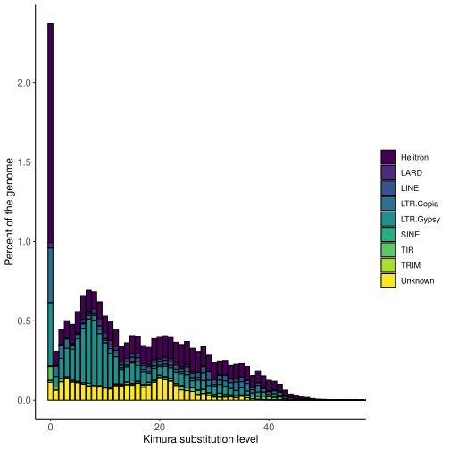
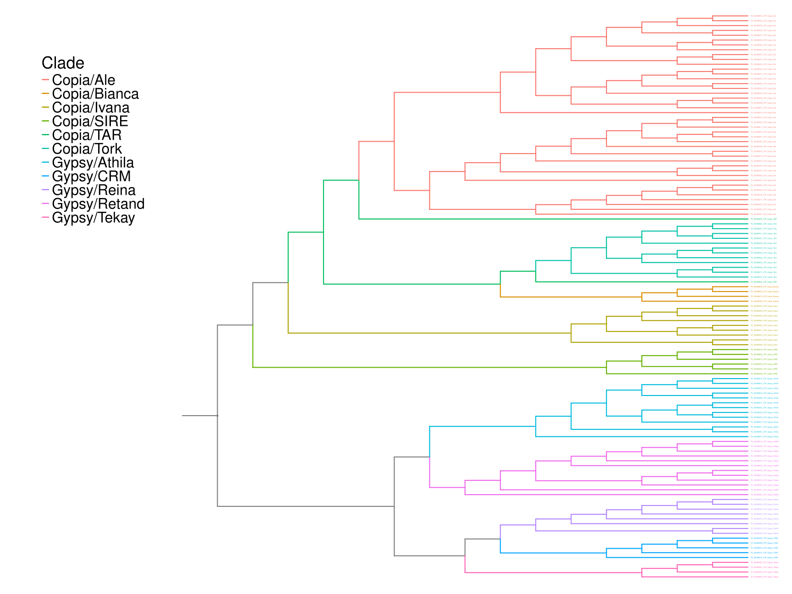

<div align="center"> 
    
</div><br>

<div align="center">

   
</div>


# AnnoTEP
AnnoTEP is a platform designed for the annotation of transposable elements (TEs) in plant genomes. Developed on the basis of the [EDTA](https://github.com/oushujun/EDTA) pipeline, the tool incorporates specific modifications inspired by [Plant genome Annotation](https://github.com/amvarani/Plant_Annotation_TEs) pipeline, as well as adjustments that improve its performance and flexibility. One of AnnoTEP's great differentials is its user-friendly interface, built with HTML and Python technologies, which makes the process accessible even to researchers with little familiarity with command lines. Combining efficiency, customisation and ease of use, AnnoTEP offers a powerful solution for the analysis and annotation of TEs, contributing to significant advances in plant genomic research.

AnnoTEP is currently available in three formats: web server, container with graphic interface and container with bash interface. Clicking on each format below will take you to the system where you can access or install the platform:
- [Web Server](https://plantgenomics.ncc.unesp.br/AnnoTEP/) 
- [Graphic Interface](#graphic-interface)
- [Bash Interface](#bash-interface)

## Tool functions
* Identification of LTRs elements, LINEs, SINEs, TIR elements
* Identification of non-autonomous LTR elements, such as TRIM, LARD, TR-GAG, and BARE2;
* Identification of soloLTR;
* Identification of non-autonomous TIR elements, such as MITE;
* In-depth analysis of autonomous and non-autonomous Helitron elements.
* Genome masking (local mode)
* Report generation on TEs
* Generation of graphs illustrating repeated elements
* Generation of age graphs for Gypsy and Copia elements
* Generation of LTR phylogeny and density graphs
<br>

# Table of contents
* [Installation with Container](#installation-with-container)
    * [Graphic Interface](#graphic-interface)
    * [Bash Interface](#bash-interface)
* [Installation with Github](#installation-with-github)
    * [Results](#results)
    * [Running the platform with a graphical interface via github](#running-the-platform-with-a-graphical-interface-via-github)
    * [Running the platform with bash interface via github](#running-the-platform-with-bash-interface-via-github)
<br>

# Installation with Container
AnnoTEP can be installed on the machine in different ways, one of which is using Docker. The tool is available in two formats: with a graphical interface and without an interface (terminal mode). To follow the steps below, you need to have Docker installed on your machine. You can download it directly from the official [Docker website](https://docs.docker.com/engine/install/)


## Graphic Interface
<div align="center"> 
    
</div><br>

**Important**: for this version your machine must have access to the internet network

Open the terminal and run the following commands:

**Step 1.** Download the AnnoTEP image:
```sh
docker pull annotep/graphic-interface:v2
```

**Step 2.** Next, run the container with the command below, specifying a folder to store the annotation results on your machine:
```sh
docker run -it -v {folder-results}:/root/TEs/graphic-interface/results -dp 0.0.0.0:5000:5000 --pids-limit {threads x 10000} --memory-swap -1 annotep/graphic-interface:v2
```

### Description:
- ``-v {folder-results}:/root/TEs/graphic-interface/results``: This creates a volume between the host and the container to store data. You can replace ``-v {folder-results}`` with any folder path on your machine, if you don't have the folder created Docker will create it. ``/root/TEs/graphic-interface/results`` is the path of the directory folder, you don't need to change it.
- ``-dp 0.0.0.0:5000:5000``: Maps the container's port 5000 to the host's port 5000.
- ``annotep/graphic-interface:v2``: Specifies the image to be used.
- ``--pids-limit {threads x 10000}``: Defines the limit of processes that the container can create. **Example:** If you use 12 threads, the value will be 120,000. This ensures that each thread can create subprocesses without exhausting the process limit, maintaining performance at high load.
- ``--memory-swap -1``: Disables the swap usage limit. This allows the container to use unlimited virtual memory, helping to avoid errors when physical RAM is insufficient.

#### Example:
```sh
docker run -it -v $HOME/results-annotep:/root/TEs/graphic-interface/results -dp 0.0.0.0:5000:5000 --pids-limit 120000 --memory-swap -1 annotep/graphic-interface:v2
```

**Step 3.** After running the container with the previous command, access the AnnoTEP interface by typing the following address into your web browser: 
``127.0.0.1:5000``

**Step 4.** When you access 127.0.0.1:5000 you will see a version of the AnnoTEP platform similar to the WEB version. 

* If you want to run tests, you can download the file _Arabidopsis thaliana_ (Chromosome 4) `AtChr4.fasta` from the repository. **The annotation process can take 1 hour if 10 threads are used.**.

* This version includes a field for the number of threads when using and it is recommended that you have at least 4 threads on your machine. **Please note that the fewer the threads, the longer it will take to analyze the element.**

**Step 5.** Within the interface you can enter your data such as: email, genome and annotation type and send it for analysis. When the work is completed without any errors, you will receive an e-mail informing you that the results are available in the directory entered in ``-v {folder-results}``.

**Step 6:** You can follow the progress of the annotation via the Docker logs.
   * In the terminal, type ``docker ps``.
   * A list of active containers will appear. Select the ``CONTAINER ID`` of the AnnoTEP image.
   * With the ID copied, type and paste: ``docker logs -f {CONTAINER ID}``.

**Important2**: Avoid shutting down the machine during the process, as this could interrupt the data analysis. Even when using the web system, processing takes place locally on your machine.

**Important3**: Bear in mind that the speed of the annotation will depend on the performance of your local machine.

Return to [Table of contents](#table-of-contents)

## Bash Interface
<div align="center"> 
    
</div><br>

While the primary focus of AnnoTEP is its user-friendly interface, we also provide a Docker version designed exclusively for command-line use. This option caters to researchers who prefer or are more accustomed to working in a terminal environment. The configurable parameters in the Docker version closely mirror those offered by the EDTA pipeline, ensuring a consistent and flexible experience for diverse workflows.

**Step 1.** Download the AnnoTEP image:
```sh
docker pull annotep/bash-interface:v2
```

**Step 2.** Use the ``-h`` parameter to display a user guide describing how to use the script:

```sh
docker run annotep/bash-interface:v2 python run_annotep.py -h
```
- You will be introduced to:
```sh
usage: run_annotep.py [-h] --genome GENOME --threads THREADS
                      [--species {Rice,Maize,others}]
                      [--step {all,filter,final,anno}] [--sensitive {0,1}]
                      [--overwrite {0,1}] [--anno {0,1}] [--evaluate {0,1}]
                      [--force {0,1}] [--u U] [--maxdiv [0-100]] [--cds CDS]
                      [--curatedlib CURATEDLIB] [--exclude EXCLUDE]
                      [--rmlib RMLIB] [--rmout RMOUT]

Run annotep with specified parameters.

optional arguments:
  -h, --help            show this help message and exit

required arguments:
  --genome GENOME       The genome FASTA file (.fasta)
  --threads THREADS     Number of threads used to complete annotation (default threads: 4)

optional arguments:
  --species {Rice,Maize,others}
                        Specify the species for identification of TIR candidates. Default: others
  --step {all,filter,final,anno}
                        Specify which steps you want to run EDTA.
  --sensitive {0,1}     Use RepeatModeler to identify remaining TEs (1) or not (0, default). This step may help to recover some TEs.
  --overwrite {0,1}     If previous raw TE results are found, decide to overwrite (1, rerun) or not (0, default).
  --anno {0,1}          Perform (1) or not perform (0, default) whole-genome TE annotation after TE library construction.
  --evaluate {0,1}      Evaluate (1) classification consistency of the TE annotation. (--anno 1 required).
  --force {0,1}         When no confident TE candidates are found: 0, interrupt and exit (default); 1, use rice TEs to continue.
  --u U                 Neutral mutation rate to calculate the age of intact LTR elements. Intact LTR age is found in this file: *EDTA_raw/LTR/*.pass.list. Default: 1.3e-8 (per bp per year, from rice).
  --maxdiv [0-100]      Maximum divergence (0-100, default: 40) of repeat fragments comparing to library sequences.
  --cds CDS             Provide a FASTA file containing the coding sequence (no introns, UTRs, nor TEs) of this genome or its close relative.
  --curatedlib CURATEDLIB
                        Provided a curated library to keep consistant naming and classification for known TEs. TEs in this file will be trusted 100%, so please ONLY provide MANUALLY CURATED ones. This option is not mandatory. It is totally OK if no file is provided (default).
  --exclude EXCLUDE     Exclude regions (bed format) from TE masking in the MAKER.masked output. Default: undef. (--anno 1 required).
  --rmlib RMLIB         Provide the RepeatModeler library containing classified TEs to enhance the sensitivity especially for LINEs. If no file is provided (default), EDTA will generate such file for you.
  --rmout RMOUT         Provide your own homology-based TE annotation instead of using the EDTA library for masking. File is in RepeatMasker .out format. This file will be merged with the structural-based TE annotation. (--anno 1 required). Default: use the EDTA library for annotation.
```
<br>

**Step 3.** To simplify this step, we recommend creating a folder to insert your genomic data in FASTA format. Once created, run the container using the command below as a guide. Make sure you provide the full path to the folder where you want to save the results, as well as the full path to the genomes folder:

```sh
docker run -it -v {folder-results}:/root/TEs/bash-interface/results -v {absolute-path-to-folder-genomes}:{absolute-path-to-folder-genomes} --pids-limit {threads x 10000} --memory-swap -1 annotep/bash-interface:v2 python run_annotep.py --genome {absolute-path-to-folder-genomes/genome.fasta} --threads {number}
```

### Description:
- ``-v {folder-results}:/root/TEs/bash-interface/results``: This creates a volume between the host and the container to store data. You can replace ``-v {folder-results}`` with any folder path on your machine where you want to save the results, if you don't have the folder created Docker will create it. ``/root/TEs/www/results`` is the directory folder path, you don't need to change it.
- ``-v {absolute-path-to-folder-genomes}:{absolute-path-to-folder-genomes}``: It is responsible for creating a temporary copy of the genomic files inside Docker, which is why you must enter the correct address of the folder that stores the genomes in ``{absolute-path-to-folder-genomes}``.
- ``--genome {absolute-path-to-folder-genomes/genome.fasta}``: Here you must enter the correct address of the folder that stores the genomes along with the name of the genome you want to annotate.
- ``--threads {number}``: define the number of threads.
- ``--pids-limit {threads x 10000}``: Defines the limit of processes that the container can create. **Example:** If you use 12 threads, the value will be 120,000. This ensures that each thread can create subprocesses without exhausting the process limit, maintaining performance at high load.
- ``--memory-swap -1``: Disables the swap usage limit. This allows the container to use unlimited virtual memory, helping to avoid errors when physical RAM is insufficient.

* If you want to run tests, you can download the file _Arabidopsis thaliana_ (Chromosome 4) `AtChr4.fasta` from the repository. **The annotation process can take 1 hour if 10 threads are used.**.


#### Example 1:
```sh
docker run -it -v $HOME/results-annotep:/root/TEs/bash-interface/results -v /home/user/Documents/TEs:/home/user/Documents/TEs --pids-limit 120000 --memory-swap -1 annotep/bash-interface:v2 python run_annotep.py --genome /home/user/TEs/AtChr4.fasta --threads 12 --sensitive 1 --anno 1
```

**Step 4.** Now wait for the genome annotation to be completed by following the analysis through the terminal

Return to [Table of contents](#table-of-contents)
<br>

# Installation with Github
 * The installation guide to be presented was adapted from [Plant genome Annotation](https://github.com/amvarani/Plant_Annotation_TEs), with some modifications throughout the code. 
 * **Plant Genome Annotation** uses modified code from the [AnnoSINE](https://github.com/baozg/AnnoSINE), [MGEScan-non-LTR](https://github.com/MGEScan), [TEsorter](https://github.com/zhangrengang/TEsorter) and [EDTA](https://github.com/oushujun/EDTA) pipelines.

## Prerequisites
- [Python 3.6+](https://www.python.org/)

- [Miniconda3](https://docs.conda.io/projects/miniconda/en/latest/)

- [R 4.4+](https://cran.r-project.org/bin/linux/ubuntu/fullREADME.html)

- System Ubuntu (20.04.6 LTS, 22.04.4 LTS)

#### MiniConda install
After downloading miniconda from the link above, run it in the terminal window:
```sh
bash Miniconda3-latest-Linux-x86_64.sh
```

## Download the repository
**Step 1.** In the terminal run:
```sh
git clone https://github.com/Marcos-Fernando/AnnoTEP_v1.git $HOME/TEs
```

**Step 2.** Access the repository location on the machine:
```sh
cd $HOME/TEs
```

Note: Pay attention to the name of the folder. In this guide, we will be using the folder named ``TEs``. To make configuration easier, we recommend using this name.

## Configuring the repository
### Libraries
**Step 1.** In the terminal download the following libraries:
```sh
sudo apt-get install libgdal-dev lib32z1 python-is-python3 python3-setuptools python3-biopython python3-xopen trf hmmer2 seqtk
sudo apt-get install hmmer emboss python3-virtualenv python2 python2-setuptools-whl python2-pip-whl cd-hit iqtree
sudo apt-get install python2-dev build-essential linux-generic libmpich-dev libopenmpi-dev bedtools pullseq bioperl
sudo apt-get install pdf2svg

# R dependencies
sudo apt-get install r-cran-ggplot2 r-cran-tidyr r-cran-reshape2 r-cran-reshape rs r-cran-viridis r-cran-tidyverse r-cran-gridextra r-cran-gdtools r-cran-phangorn r-cran-phytools r-cran-ggrepel
```
Access the R program from the terminal and install libraries from within it:
```sh
R

install.packages("hrbrthemes")

if (!require("BiocManager", quietly = TRUE))
    install.packages("BiocManager")
BiocManager::install("ggtree")
BiocManager::install("ggtreeExtra")
```

- In the event of an error with BiocManager or the ggtree and ggtreeExtra packages, you can use another method:
```sh
if (!requireNamespace("devtools", quietly = TRUE))
    install.packages("devtools")
devtools::install_github("YuLab-SMU/ggtree")
devtools::install_github("YuLab-SMU/ggtreeExtra")
```

**Step 2.** After installing the libraries, copy the ``irf`` and ``break_fasta.pl`` scripts to local/bin on your machine:
```sh
sudo cp Scripts/irf /usr/local/bin
sudo cp Scripts/break_fasta.pl /usr/local/bin
```

**Step 3.** Then configure the TEsorter:
```sh
cd $HOME/TEs/TEsorter
sudo python3 setup.py install
```

Check the version of python on the machine to proceed with the configuration
* Python 3.7
```sh
cd /usr/local/lib/python3.7/dist-packages/TEsorter-1.4.1-py3.6.egg/TEsorter/database/
```

* Python 3.10
```sh
cd /usr/local/lib/python3.10/dist-packages/TEsorter-1.4.1-py3.10.egg/TEsorter/database/
```
...

```sh
sudo hmmpress REXdb_v3_TIR.hmm
sudo hmmpress Yuan_and_Wessler.PNAS.TIR.hmm
sudo hmmpress REXdb_protein_database_viridiplantae_v3.0_plus_metazoa_v3.hmm
sudo hmmpress REXdb_protein_database_viridiplantae_v3.0.hmm
sudo hmmpress REXdb_protein_database_metazoa_v3.hmm
sudo hmmpress Kapitonov_et_al.GENE.LINE.hmm
sudo hmmpress GyDB2.hmm
sudo hmmpress AnnoSINE.hmm
cd $HOME/TEs 
```
### Downloading genomes for testing
At this stage you can choose to use your data or download some examples for testing:
* _Theobrama cacao_
```sh
wget https://cocoa-genome-hub.southgreen.fr/sites/cocoa-genome-hub.southgreen.fr/files/download/Theobroma_cacao_pseudochromosome_v1.0_tot.fna.tar.gz
tar xvfz Theobroma_cacao_pseudochromosome_v1.0_tot.fna.tar.gz
mv Theobroma_cacao_pseudochromosome_v1.0_tot.fna Tcacao.fasta
rm Theobroma_cacao_pseudochromosome_v1.0_tot.fna.tar.gz
```

* _Arabidopsis thaliana_ 
```sh
wget https://www.arabidopsis.org/download_files/Genes/TAIR10_genome_release/TAIR10_chromosome_files/TAIR10_chr_all.fas.gz
gzip -d TAIR10_chr_all.fas.gz
cat TAIR10_chr_all.fas | cut -f 1 -d" " > At.fasta
rm TAIR10_chr_all.fas
```

If the link fails, try it:
```sh
wget --header="User-Agent: Mozilla/5.0 (Windows NT 10.0; Win64; x64) AppleWebKit/537.36 (KHTML, like Gecko) Chrome/91.0.4472.124 Safari/537.36" \
"https://www.arabidopsis.org/download_files/Genes/TAIR10_genome_release/TAIR10_chromosome_files/TAIR10_chr_all.fas.gz"
```


* If you can't download _Arabidopsis thaliana_ automatically, you can download it directly from [tair](https://www.arabidopsis.org/download/list?dir=Genes%2FTAIR10_genome_release%2FTAIR10_chromosome_files), by clicking on `TAIR10_chr_all.fas.gz` and following the steps in the command above from the second line onwards.


### Configuring modified EDTA
**Step 1.** Install and activate the EDTA conda environment:
```sh
cd EDTA
bash

conda env create -f EDTA_2.2.x.yml
conda activate EDTA2
perl EDTA.pl
```

**Step 2.** Running EDTA:
```sh
cd ..
mkdir Athaliana
cd Athaliana

nohup $HOME/TEs/EDTA/EDTA.pl --genome ../At.fasta --species others --step all --sensitive 1 --anno 1 --threads 12 > EDTA.log 2>&1 &
```

**Step 3.** Track progress by:
```sh
tail -f EDTA.log
```

**Notes:**

**1.** Set the number of threads available on your computer or server. Set the maximum available. In our code it is set to 12.

**2.** For more accurate TE detection and annotation, activate the "sensitive" flag. This will activate the RepeatModeler to identify remaining TEs and other repeats. The RepeatModeler step will also generate the Superfamily and Lineage TE classification.
<br>

---
### Smooth masking
Generally, non-autonomous elements can carry passenger genes (for example, non-autonomous LARDs and Helitrons). Therefore, for proper annotation of the genome, these elements must be partially masked. The modified EDTA pipeline will take care of this automatically and generate a suitably masked genome sequence for structural gene annotation. The softmasked genome sequence is available in the EDTA folder, with the name $genome-Softmasked.fa .

---
<br>

Return to [Table of contents](#table-of-contents)

# Results
**Step 1. Create and activate the virtual environment:** Before proceeding, deactivate Conda if it is active to avoid dependency conflicts. It is recommended to create a Python virtual environment to ensure an isolated and appropriate setup for executing the next command. Follow the steps below:
```sh
python -m venv .venv

. .venv/bin/activate
```

**Step 2. Install the required packages:** With the virtual environment activated, install the necessary dependencies for the application by running the command below:
 ```sh
pip install -r required.txt 
```

**Step 3. Run the processing script:** Once the environment is set up, execute the following command to generate new data and graphs from the input file (e.g., At.fasta):
 ```sh
python -u $HOME/TEs/Scripts/process_graphic.py At.fasta
```

Note: Make sure to replace At.fasta with the name of the input file you wish to process, if it is different.

At the end of the analysis, three main directories will be generated: **TE-REPORT**, **LTR-AGE**, and **TREE**, containing detailed results and relevant visualisations. Below is a comprehensive description of each folder and its contents:

## TE-REPORT
This directory includes the following files and charts:
- ``TEs-Report-Complete.txt``: A comprehensive table listing the classifications of transposable elements (TEs), including partial elements, which are labelled with the suffix “-like” (e.g., Angela-like).
<div align="center">
    
</div>

- ``TEs-Report-Lite.txt``: A simplified report derived from the complete version, containing concise and accessible information.
<div align="center">
    
</div>

- ``TE-Report*``: These charts, generated from the ``TEs-Report-Lite.txt`` file, provide a clear and informative visualisation of TEs, categorised by hierarchical levels.
<div align="center">
    
    
    
    
</div>

- ``RepeatLandScape.*``: This chart provides a reasonable inference of the relative ages of each element identified in the analysed genome.
<div align="center">
    
</div>

### LTR-AGE
This directory contains charts that estimate the ages of LTR Gypsy and LTR Copia elements:
- ``AGE-Gypsy.*`` and ``AGE-Copia.*``: gráficos que estimam as idades dos elementos LTR Gypsy e LTR Copia
<div align="center">
    
    
</div>

### TREE
This directory contains phylogenetic charts for the alignments of all LTR-RT domains:

- ``LTR_RT-Tree1.*``, ``LTR_RT-Tree3.*``, ``LTR_RT-Tree4.*``: These represent the phylogeny of LTR-RT domains in different formats.
<div align="center">
    
    
    
</div>

- ``LTR_RT-Tree2.*``: A circular chart where: 
    - The outer circle (purple) represents the length (in base pairs) occupied by each element.
    - The inner circle (red) represents the number of occurrences of each element.
<div align="center">
    
</div>
<br>

Return to [Table of contents](#table-of-contents)

<br>

# Running the platform with a graphical interface via github
**Step 1.** Access the ``graphic-interface`` folder and create a Python virtual environment by running the following commands in your terminal. Make sure you have done the [environment setup](#organizing-theenvironment) before proceeding.
```sh
python -m venv .graphic

. .graphic/bin/activate
```
<br>

**Step 2:** Install the packages needed for the application by running the following command (this only needs to be done once):
```sh
pip install -r required.txt 
```
- Inside the ``required.txt`` file, you'll find the fundamental libraries, such as Flask and python-dotenv. If any package shows an error, you'll need to install it manually.

**Step 3:** Now, inside the "graphic-interface" folder and with the virtual environment activated, run the following command to start the application:
```sh
flask run
```

If all the settings are correct, you will see a message similar to this one:
```sh
 * Serving Flask app 'main.py' (lazy loading)
 * Environment: development
 * Debug mode: on
 * Running on http://127.0.0.1:5000/ (Press CTRL+C to quit)
 * Restarting with stat
 * Debugger is active!
 * Debugger PIN: 264-075-516
```

**Step 4.** Click on the link http://127.0.0.1:5000/ or copy and paste it into your browser to access the platform and start testing it.

<br>

# Running the platform with bash interface via github
**Step 1.** Access the ``bash-interface`` folder folder and create a Python virtual environment by running the following commands in your terminal. Make sure you have done the [environment setup](#organizing-theenvironment) before proceeding.
```sh
python -m venv .venv

. .venv/bin/activate
```

**Step 2.** Go to the "local" folder and run the ``run_annotep.py`` script by typing the following command:
```sh
python run_annotep.py -h
```

- The ``-h`` parameter displays a user guide describing how to use the script:
```sh
usage: run_annotep.py [-h] --genome GENOME --threads THREADS
                      [--species {Rice,Maize,others}]
                      [--step {all,filter,final,anno}] [--sensitive {0,1}]
                      [--overwrite {0,1}] [--anno {0,1}] [--evaluate {0,1}]
                      [--force {0,1}] [--u U] [--maxdiv [0-100]] [--cds CDS]
                      [--curatedlib CURATEDLIB] [--exclude EXCLUDE]
                      [--rmlib RMLIB] [--rmout RMOUT]

Run annotep with specified parameters.

optional arguments:
  -h, --help            show this help message and exit

required arguments:
  --genome GENOME       The genome FASTA file (.fasta)
  --threads THREADS     Number of threads used to complete annotation (default threads: 4)

optional arguments:
  --species {Rice,Maize,others}
                        Specify the species for identification of TIR candidates. Default: others
  --step {all,filter,final,anno}
                        Specify which steps you want to run EDTA.
  --sensitive {0,1}     Use RepeatModeler to identify remaining TEs (1) or not (0, default). This step may help to recover some TEs.
  --overwrite {0,1}     If previous raw TE results are found, decide to overwrite (1, rerun) or not (0, default).
  --anno {0,1}          Perform (1) or not perform (0, default) whole-genome TE annotation after TE library construction.
  --evaluate {0,1}      Evaluate (1) classification consistency of the TE annotation. (--anno 1 required).
  --force {0,1}         When no confident TE candidates are found: 0, interrupt and exit (default); 1, use rice TEs to continue.
  --u U                 Neutral mutation rate to calculate the age of intact LTR elements. Intact LTR age is found in this file: *EDTA_raw/LTR/*.pass.list. Default: 1.3e-8 (per bp per year, from rice).
  --maxdiv [0-100]      Maximum divergence (0-100, default: 40) of repeat fragments comparing to library sequences.
  --cds CDS             Provide a FASTA file containing the coding sequence (no introns, UTRs, nor TEs) of this genome or its close relative.
  --curatedlib CURATEDLIB
                        Provided a curated library to keep consistant naming and classification for known TEs. TEs in this file will be trusted 100%, so please ONLY provide MANUALLY CURATED ones. This option is not mandatory. It is totally OK if no file is provided (default).
  --exclude EXCLUDE     Exclude regions (bed format) from TE masking in the MAKER.masked output. Default: undef. (--anno 1 required).
  --rmlib RMLIB         Provide the RepeatModeler library containing classified TEs to enhance the sensitivity especially for LINEs. If no file is provided (default), EDTA will generate such file for you.
  --rmout RMOUT         Provide your own homology-based TE annotation instead of using the EDTA library for masking. File is in RepeatMasker .out format. This file will be merged with the structural-based TE annotation. (--anno 1 required). Default: use the EDTA library for annotation.
```

**Step 3:** Run the command adding the full path of the directory containing the genome and the type of annotation you want:
```sh

python run_annotep.py --genome {absolute-path-to-folder-genomes}/genome.fasta --threads number
```

#### Example 1:
```sh
python run_annotep.py --genome /home/user/TEs/At.fasta --threads 12
```

#### Example 2:
```sh
python run_annotep.py --genome /home/user/Documents/At.fasta --threads 12 --sensitive 1 --anno 1
```

<br>

Return to [Table of contents](#table-of-contents)