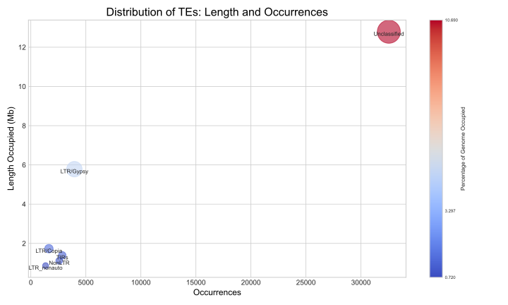
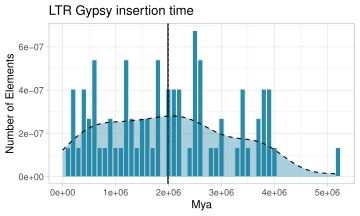
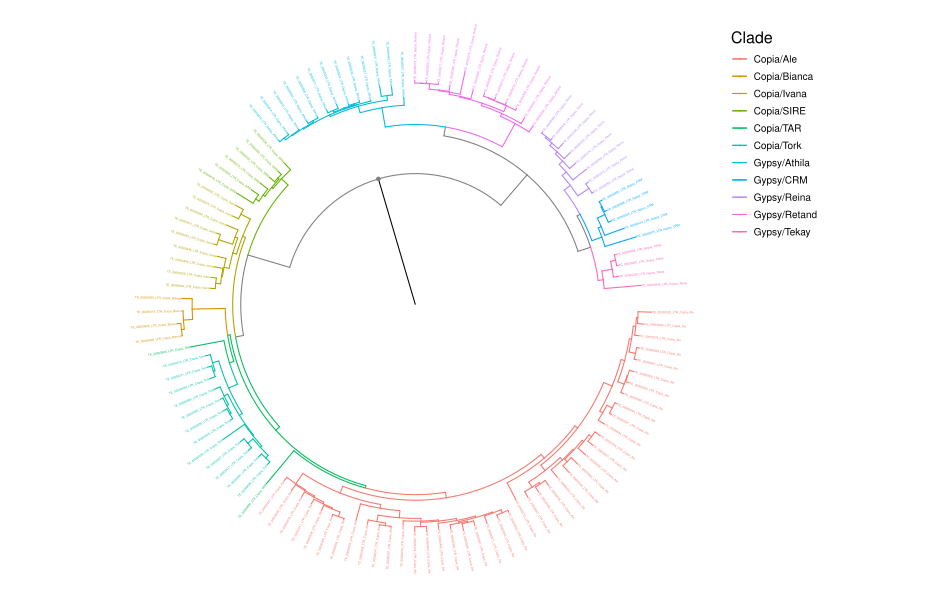
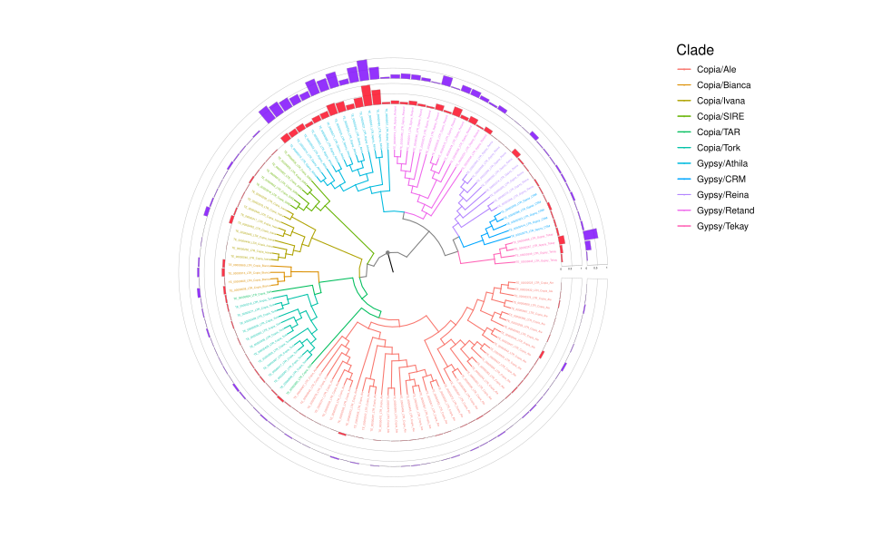

<div align="center"> 
    
</div><br>

<div align="center">

     
 
</div>

# Table of contents
* [📖 Introduction](#introduction)
* [⚙️ Installing with library and conda](#installing-with-library-and-conda)
    * [🧪 Testing](#testing)
    * [🎨 Generating Graphs](#generating-graphs)
        * [📝 Running AnnoTEP CLI in Alternative Ways](#running-annotep-cli-in-alternative-ways)
    * [🖥️ Using AnnoTEP with graphical user interface](#using-annotep-with-graphical-user-interface)
* [⚙️ Installing with Container](#installing-with-container)
    * [🖌️ Graphic User Interface - GUI](#graphic-user-interface---gui)
    * [✏️ Command Line Interface - CLI](#command-line-interface---cli)
* [🔬 Results](#results)
    * [🗂️ TE-REPORT](#te-report)
    * [🗂️ LTR-AGE](#ltr-age)
    * [🗂️ TREE](#tree)
* [🧬 List of genomes tested in this pipeline](#list-of-genomes-tested-in-this-pipeline)
* [📝 Citations](#citations)
* [🗨️ Questions and Issues](#:left_speech_bubble:-questions-and-issues)
<br>

# Introduction
AnnoTEP is a platform designed for the annotation of transposable elements (TEs) in plant genomes. Developed on the basis of the [EDTA](https://github.com/oushujun/EDTA) pipeline, the tool incorporates specific modifications inspired by [Plant genome Annotation](https://github.com/amvarani/Plant_Annotation_TEs) pipeline, as well as adjustments that improve its performance and flexibility. One of AnnoTEP's great differentials is its graphic user interface, built with HTML and Python technologies, which makes the process accessible even to researchers with little familiarity with command lines. Combining efficiency, customisation and ease of use, AnnoTEP offers a powerful solution for the analysis and annotation of TEs, contributing to significant advances in plant genomic research.

In addition to its GitHub repository, AnnoTEP also has a [website](https://plantgenomics.ncc.unesp.br/AnnoTEP/) that centralises its documentation, displays the genome mutation rate table, and showcases a selection of pre-processed genomes using the tool.

### Functions of AnnoTEP
* Enhancement in the detection of LTRs, LINEs, TIRs, and Helitrons.
* Improved identification and classification of non-autonomous LTRs, such as TRIM, LARD, TR-GAG, and BARE2.
* Detection of solo LTRs.
* Classification of lineages belonging to the Copia and Gypsy superfamilies.
* Classification of Helitrons into autonomous and non-autonomous.
* Optimisation of repetitive sequence masking.
* Generation of transposable element (TE) classification reports.
* Creation of repeat landscape plots, histograms, and phylogenetic trees of LTR lineages.

<br>

# 🔧 Installing and configuring environments
O AnnoTEP pode ser instalado de diferentes maneiras, dependendo das suas preferências e necessidades. Neste tutorial, vamos guiá-lo através de dois métodos principais de instalação: o método tradicional e a instalação via Docker. Ambos os métodos são detalhados para garantir uma configuração suave e eficiente em sua máquina.

# ⚙️ Installing with library and conda

### Prerequisites
- 🐍 [Python 3.7+](https://www.python.org/)  
- 📦 [Miniconda3](https://docs.conda.io/projects/miniconda/en/latest/)  
- 📊 [R 4.4+](https://cran.r-project.org/bin/linux/ubuntu/fullREADME.html)  
- 🖥️ System Ubuntu (20.04.6 LTS, 22.04.4 LTS)


### MiniConda Installation
After downloading Miniconda from the link above, run the following command in your terminal:
 ```sh
 bash Miniconda3-latest-Linux-x86_64.sh
 ```

 <!-- ### Download the repository
 **Step 1.**  Clone the repository by running the following command in your terminal:
 ```sh
 git clone https://github.com/Marcos-Fernando/AnnoTEP.git $HOME/AnnoTEP
 ```

**Step 2.** Navigate to the repository directory:
```sh
cd {absolute-path-to-folder-AnnoTEP}/AnnoTEP
```

> [!TIP] 
> Pay attention to the name of the folder. In this guide, we will be using the folder named ``AnnoTEP``. To make configuration easier, we recommend using this name. -->

## ⚙️ Configuring the repository
### Installing Required Libraries
**Step 1.** Install the necessary libraries by running the following commands in your terminal:
```sh
sudo apt-get install libgdal-dev lib32z1 python-is-python3 python3-setuptools python3-biopython python3-xopen trf hmmer2 seqtk libtext-soundex-perl
sudo apt-get install hmmer emboss python3-virtualenv cd-hit iqtree build-essential linux-generic libmpich-dev libopenmpi-dev bedtools pullseq bioperl
sudo apt-get install pdf2svg

# R dependencies
sudo apt-get install r-cran-ggplot2 r-cran-tidyr r-cran-reshape2 r-cran-reshape rs r-cran-viridis r-cran-tidyverse r-cran-gridextra r-cran-gdtools r-cran-phangorn r-cran-phytools r-cran-ggrepel
```
Access the R program from the terminal and install libraries from within it:
```sh
R

install.packages("hrbrthemes")

if (!require("BiocManager", quietly = TRUE))
    install.packages("BiocManager")
BiocManager::install("ggtree")
BiocManager::install("ggtreeExtra")
```

- <b>Alternative Method:</b> If you encounter errors with ``BiocManager``, ``ggtree``, or ``ggtreeExtra``, use the following approach:
```sh
if (!requireNamespace("devtools", quietly = TRUE))
    install.packages("devtools")
devtools::install_github("YuLab-SMU/ggtree")
devtools::install_github("YuLab-SMU/ggtreeExtra")
```

**Step 2.** Copy the ``break_fasta.pl`` scripts to ``/usr/local/bin``:
```sh
sudo cp Scripts/break_fasta.pl /usr/local/bin
```

### Configuring modified EDTA
**Step 1.** AnnoTEP uses the same installation method as EDTA. To set up the environment, navigate to the AnnoTEP folder and follow the steps below:
```sh
# Navigate to the EDTA directory
cd EDTA

conda env create -f EDTA_2.2.x.yml
conda activate EDTA2
perl EDTA.pl
```

## 🧪 Testing 
### Downloading genomes
**Step 1.** You can choose to use your own data or download example genomes for testing: <br>

🧬 _Theobrama cacao_
```sh
wget https://cocoa-genome-hub.southgreen.fr/sites/cocoa-genome-hub.southgreen.fr/files/download/Theobroma_cacao_pseudochromosome_v1.0_tot.fna.tar.gz
tar xvfz Theobroma_cacao_pseudochromosome_v1.0_tot.fna.tar.gz
mv Theobroma_cacao_pseudochromosome_v1.0_tot.fna Tcacao.fasta
rm Theobroma_cacao_pseudochromosome_v1.0_tot.fna.tar.gz
```
<br>

🧬 _Arabidopsis thaliana_ 
```sh
wget https://www.arabidopsis.org/download_files/Genes/TAIR10_genome_release/TAIR10_chromosome_files/TAIR10_chr_all.fas.gz
gzip -d TAIR10_chr_all.fas.gz
cat TAIR10_chr_all.fas | cut -f 1 -d" " > At.fasta
rm TAIR10_chr_all.fas
```
> [!NOTE]
> If you can't download _Arabidopsis thaliana_ automatically, you can manually download it from [tair](https://www.arabidopsis.org/download/list?dir=Genes%2FTAIR10_genome_release%2FTAIR10_chromosome_files), Click on `TAIR10_chr_all.fas.gz` and follow the commands above starting from the second line.

**Step 2.** Run EDTA on the downloaded genome:
```sh
cd EDTA
mkdir Athaliana
cd Athaliana

nohup {absolute-path-to-folder-AnnoTEP}/EDTA/EDTA.pl --genome {absolute-path-to-folder-genome}/At.fasta --species others --step all --sensitive 1 --anno 1 --threads 12 > EDTA.log 2>&1 &
```

> [!NOTE]
> Replace ``{absolute path to the-AnnoTEP-folder}`` and ``{absolute path to the-genome-folder}`` with the appropriate path

**Step 3.** Monitor the progress of the EDTA run:
```sh
tail -f EDTA.log
```

> [!TIP]
>
> **1.** Adjust the number of threads based on your computer or server's capacity. Set it to the maximum available. In the example above, it is set to 12.
>
> **2.** For more accurate TE detection and annotation, enable the ``--sensitive flag``. This activates RepeatModeler to identify remaining TEs and other repeats, and it also generates Superfamily and Lineage classifications for TEs.
<br>

> [!NOTE]
> Non-autonomous elements (e.g., non-autonomous LARDs and Helitrons) can carry passenger genes. For proper genome annotation, these elements must be partially masked. The modified EDTA pipeline handles this automatically and generates a softmasked genome sequence, available in the EDTA folder as ``$genome-Softmasked.fa`` .

<br>

## 🎨 Generating Graphs
**Step 1. Create and activate the virtual environment:** Before proceeding, ``disable the Conda environment`` if it is active to prevent dependency conflicts. Then, navigate to the ``AnnoTEP folder``, create a Python virtual environment to ensure an isolated and proper setup, and finally, install the required dependencies by running the command below:
```sh
python -m venv .results
. .results/bin/activate

pip install -r requirements.txt 
```

**Step 2. Run the processing script:** Next, navigate to the folder created to store the annotated genome (e.g., Athaliana) and run the command below to generate new data and graphs from the input genome (e.g., At.fasta):
 ```sh
cd {absolute-path-to-folder-AnnoTEP}/EDTA/Athaliana
python -u {absolute-path-to-folder-AnnoTEP}/Scripts/process_graphic.py At.fasta
```

> [!TIP]
> Make sure to replace At.fasta with the name of the input file you wish to process, if it is different.

At the end of the analysis, three main directories will be generated: TE-REPORT, LTR-AGE, and TREE, each containing detailed results and relevant visualisations. In the [results section](#🔬-results), each generated graph will be described in detail.

---
### 📝 Running AnnoTEP CLI in Alternative Ways
AnnoTEP CLI can also be executed using an alternative method. Follow the steps below to set up and run the CLI.
**Step 1. Set Up the Virtual Environment:** After installing the required libraries and the conda environment, navigate to the ``bash-interface`` directory within the AnnoTEP folder. Create a Python virtual environment and install the necessary libraries:
```sh
python -m venv .bashinterface

. .bashinterface/bin/activate
pip install -r requirements.txt 
```

**Step 2. Run the AnnoTEP CLI Script:** Once the installation is complete, execute the ``run_annotep.py`` script. You can check the available options using the ``-h`` flag:
```sh
python run_annotep.py -h
```

* To run the script with your genome file, use the following command:

```sh
python run_annotep.py --genome {absolute-path-to-folder-genomes}/genome.fasta --threads number
```

> [!NOTE]
> This script uses the same parameters as EDTA. The key difference is that it automatically generates the graphs without requiring additional commands.

<br>

# 🖥️ Using AnnoTEP with Graphical User Interface
> [!IMPORTANT]
> Before proceeding, ensure that all required libraries and the conda environment have been installed.

**Step 1. Set Up the Virtual Environment:** Navigate to the ``graphic-interface`` folder within the AnnoTEP directory. Create a Python virtual environment and install the necessary libraries:
```sh
python -m venv .graphic

. .graphic/bin/activate
pip install -r requirements.txt 
```
<br>

> [!NOTE]
> The ``requirements.txt`` file contains essential libraries, such as Flask and python-dotenv. If any package fails to install, you may need to install it manually.

**Step 2. Configure the .flaskenv File:** Create and configure a ``.flaskenv`` file. This file is essential for setting up Flask and enabling email functionality. Below is an example configuration:
```sh
FLASK_APP = "main.py"
FLASK_DEBUG = True
FLASK_ENV = development

MAIL_SERVER=server-email
MAIL_PORT=number
MAIL_USE_TLS=True
MAIL_USE_SSL=False
MAIL_USERNAME=your@email.com
MAIL_PASSWORD=app*password*
```
> [!NOTE]
> <b> Email Server Settings: </b>
> * Gmail:
>   * Server: smtp.gmail.com - Port: 587 (TLS) or 465 (SSL) 
>   * Outlook: smtp.office365.com - Port: 587 (TLS)
> <br>
>
> <b>App Password for Gmail:</b> <br>
> To generate an app password for Gmail, follow these steps:
> 1. Go to your Google Account settings.
> 2. Search for "App Passwords" in the search bar.
> 3. Generate a new app password and use it in the MAIL_PASSWORD field.

<br>

> [!WARNING]
> <b> Security Recommendations: </b>
> * You do not need to use your primary Gmail account. You can create and use any email address for this method.
> * When sharing this configuration, <b>never share the ``.flaskenv`` file</b> or its contents, as it contains sensitive information.

**Step 3. Run the Application:** Inside the ``graphic-interface`` folder and with the virtual environment activated, start the application by running:
```sh
flask run
```

If all settings are correct, you will see a message similar to this:
```sh
 * Serving Flask app 'main.py' (lazy loading)
 * Environment: development
 * Debug mode: on
 * Running on http://127.0.0.1:5000/ (Press CTRL+C to quit)
 * Restarting with stat
 * Debugger is active!
 * Debugger PIN: 264-075-516
```

**Step 4. Access the Platform:** Click on the link http://127.0.0.1:5000/ or copy and paste it into your browser to access the platform and start testing it.

Return to [Table of contents](#table-of-contents)

<br>

---
# ⚙️ Installing with Container
AnnoTEP can be installed on the machine in different ways, one of which is using Docker. The tool is available in two formats: with a graphical interface and without an interface (terminal mode). To follow the steps below, you need to have Docker installed on your machine. You can download it directly from the official [Docker website](https://docs.docker.com/engine/install/)


## 🖌️ Graphic User Interface - GUI
<div align="center"> 
    
</div><br>

>[!IMPORTANT] 
> For this version, your machine must have access to the internet.

Open the terminal and run the following commands:

**Step 1. Download the AnnoTEP Image:** Open your terminal and run the following command to download the AnnoTEP Docker image:
```sh
docker pull annotep/annotep-gui:v1
```

**Step 2. Run the Container** Next, run the container using the command below. Specify a folder on your machine to store the annotation results:
```sh
docker run -it -v "{folder-results}":/root/TEs/graphic-interface/results -dp 0.0.0.0:5000:5000 --pids-limit "{threads x 10000}" --memory-swap -1 annotep/annotep-gui:v1
```
> [!TIP]
> ### Description:
> - ``-v {folder-results}:/root/TEs/graphic-interface/results``: Creates a volume between your machine and the container to store results. Replace ``-v {folder-results}`` with the path to a folder on your machine. If the folder doesn't exist, Docker will create it. The path ``/root/TEs/graphic-interface/results`` is the directory inside the container and should not be changed.
> - ``-dp 0.0.0.0:5000:5000``: Maps port 5000 on the container to port 5000 on your machine.
> - ``annotep/annotep-gui:v1``: Specifies the Docker image to use.
> - ``--pids-limit {threads x 10000}``:Sets the maximum number of processes the container can create. For example, if you use 12 threads, set this value to 120,000. This ensures each thread can create subprocesses without hitting the process limit, maintaining performance under high load.
> - ``--memory-swap -1``: Disables the swap memory limit, allowing the container to use unlimited virtual memory. This helps avoid errors when physical RAM is insufficient.

#### Example:
```sh
docker run -it -v /home/user/results-annotep:/root/TEs/graphic-interface/results -dp 0.0.0.0:5000:5000 --pids-limit 120000 --memory-swap -1 annotep/annotep-gui:v1
```

**Step 3. Acess the AnnoTEP interface:** After running the container, access the AnnoTEP interface by typing the following address into your web browser:``127.0.0.1:5000``

> [!TIP]
> 📌 When you access 127.0.0.1:5000, you will see a version of the AnnoTEP platform similar to the web version.
>
> 📌 For testing, you can download the _Arabidopsis thaliana_ (Chromosome 4) file ``AtChr4.fasta`` from the repository. **The annotation process may take approximately 1 hour if 10 threads are used**.
>
> 📌 This version includes a field to specify the number of threads. It is recommended to have at least 4 threads available on your machine. **Note that fewer threads will result in longer analysis times**.

**Step 4. Submit Data for Analysis:** In the graphical interface, input the required data, such as: 
* <b> To receiveEmail Address:</b> notifications about the process status.
* <b>Genome:</b> The genome file to be analysed.
* <b>Features:</b> Choose the type of analysis to be performed.

<br>

When the process is completed without errors, you will receive an email informing you that the results are available in the specified results folder ``-v {folder-results}``.

**Step 5. Monitor Progress via Docker Logs:** To monitor the annotation progress, use the Docker logs:.
   1. In the terminal, type 
   ```sh 
   docker ps 
   ```
   2. A list of active containers will appear. Copy the ``CONTAINER ID`` of the AnnoTEP image.
   3. Use the following command to view the logs: 
   ```sh
   docker logs -f "CONTAINER ID"
   ```

>[!IMPORTANT]
> * **Avoid shutting down your machine during the process**, as this may interrupt the analysis. Even when using the web interface, processing occurs locally on your machine.
> * **Annotation speed depends on your machine's performance.** Ensure your system meets the recommended requirements for optimal results.

<br>

Return to [Table of contents](#table-of-contents)

## ✏️ Command Line Interface - CLI
<div align="center"> 
    
</div><br>

While the primary focus of AnnoTEP is its user-friendly graphical interface, we also provide a Docker version designed exclusively for command-line use. This option caters to researchers who prefer or are more accustomed to working in a terminal environment. The configurable parameters in the Docker version closely mirror those offered by the EDTA pipeline, ensuring a consistent and flexible experience for diverse workflows.

**Step 1. Download the AnnoTEP Image:** To get started, download the AnnoTEP CLI Docker image by running the following command:
```sh
docker pull annotep/annotep-cli:v1
```

**Step 2. Display the User Guide:** Use the ``-h`` parameter to display a detailed guide on how to use the script:

```sh
docker run annotep/annotep-cli:v1 python run_annotep.py -h
```

This will show the following usage instructions:

```sh
usage: run_annotep.py [-h] --genome GENOME --threads THREADS
                      [--species {Rice,Maize,others}]
                      [--step {all,filter,final,anno}] [--sensitive {0,1}]
                      [--overwrite {0,1}] [--anno {0,1}] [--evaluate {0,1}]
                      [--force {0,1}] [--u U] [--maxdiv [0-100]] [--cds CDS]
                      [--curatedlib CURATEDLIB] [--exclude EXCLUDE]
                      [--rmlib RMLIB] [--rmout RMOUT]

Run annotep with specified parameters.

optional arguments:
  -h, --help            show this help message and exit

required arguments:
  --genome GENOME       The genome FASTA file (.fasta)
  --threads THREADS     Number of threads used to complete annotation (default threads: 4)

optional arguments:
  --species {Rice,Maize,others}
                        Specify the species for identification of TIR candidates. Default: others
  --step {all,filter,final,anno}
                        Specify which steps you want to run EDTA.
  --sensitive {0,1}     Use RepeatModeler to identify remaining TEs (1) or not (0, default). This step may help to recover some TEs.
  --overwrite {0,1}     If previous raw TE results are found, decide to overwrite (1, rerun) or not (0, default).
  --anno {0,1}          Perform (1) or not perform (0, default) whole-genome TE annotation after TE library construction.
  --evaluate {0,1}      Evaluate (1) classification consistency of the TE annotation. (--anno 1 required).
  --force {0,1}         When no confident TE candidates are found: 0, interrupt and exit (default); 1, use rice TEs to continue.
  --u U                 Neutral mutation rate to calculate the age of intact LTR elements. Intact LTR age is found in this file: *EDTA_raw/LTR/*.pass.list. Default: 1.3e-8 (per bp per year, from rice).
  --maxdiv [0-100]      Maximum divergence (0-100, default: 40) of repeat fragments comparing to library sequences.
  --cds CDS             Provide a FASTA file containing the coding sequence (no introns, UTRs, nor TEs) of this genome or its close relative.
  --curatedlib CURATEDLIB
                        Provided a curated library to keep consistant naming and classification for known TEs. TEs in this file will be trusted 100%, so please ONLY provide MANUALLY CURATED ones. This option is not mandatory. It is totally OK if no file is provided (default).
  --exclude EXCLUDE     Exclude regions (bed format) from TE masking in the MAKER.masked output. Default: undef. (--anno 1 required).
  --rmlib RMLIB         Provide the RepeatModeler library containing classified TEs to enhance the sensitivity especially for LINEs. If no file is provided (default), EDTA will generate such file for you.
  --rmout RMOUT         Provide your own homology-based TE annotation instead of using the EDTA library for masking. File is in RepeatMasker .out format. This file will be merged with the structural-based TE annotation. (--anno 1 required). Default: use the EDTA library for annotation.
```
<br>

**Step 3. Run the Container:** To simplify this step, we recommend creating a folder to store your genomic data in **FASTA format**. Once created, run the container using the command below as a guide. Ensure you provide the full path to the folder where you want to save the results, as well as the full path to the genomes folder:

```sh
docker run -it -v "{folder-results}":/root/TEs/bash-interface/results -v "{absolute-path-to-folder-genomes}":"{absolute-path-to-folder-genomes}" --pids-limit "{threads x 10000}" --memory-swap -1 annotep/annotep-cli:v1 python run_annotep.py --genome "{absolute-path-to-folder-genomes/genome.fasta}" --threads "{number}"
```

>[!TIP]
> ### Description:
> - ``-v {folder-results}:/root/TEs/bash-interface/results``: Creates a volume between your machine and the container to store results. Replace ``-v {folder-results}`` with the path to a folder on your machine. If the folder doesn't exist, Docker will create it. The path ``/root/TEs/www/results``  is the directory inside the container and should not be changed.
> - ``-v {absolute-path-to-folder-genomes}:{absolute-path-to-folder-genomes}``: Creates a temporary copy of the genomic files inside Docker. Ensure you provide the correct path to the folder containing your genomes.
> - ``--genome {absolute-path-to-folder-genomes/genome.fasta}``: Specify the full path to the genome file you want to annotate.
> - ``--threads {number}``: Define the number of threads to use.
> - ``--pids-limit {threads x 10000}``: Sets the maximum number of processes the container can create. For example, if you use 12 threads, set this value to 120,000. This ensures each thread can create subprocesses without hitting the process limit, maintaining performance under high load.
> - ``--memory-swap -1``: Disables the swap memory limit, allowing the container to use unlimited virtual memory. This helps avoid errors when physical RAM is insufficient.

>[!TIP]
> For testing, you can download the Arabidopsis thaliana (Chromosome 4) file AtChr4.fasta from the repository. **The annotation process may take approximately 1 hour if 10 threads are used**.


#### Example:
```sh
docker run -it -v /home/user/results-annotep:/root/TEs/bash-interface/results -v /home/user/Documents/TEs:/home/user/Documents/TEs --pids-limit 120000 --memory-swap -1 annotep/annotep-cli:v1 python run_annotep.py --genome /home/user/TEs/AtChr4.fasta --threads 12 --sensitive 1 --anno 1
```

**Step 4. Monitor the Annotation Process:** Wait for the genome annotation to complete. You can monitor the progress directly through the terminal.

Return to [Table of contents](#table-of-contents)
<br>

# 🔬 Results
In addition to FASTA libraries, GFF3 files, and softmasking outputs, AnnoTEP also generates informative graphs and detailed reports based on the data obtained during the annotation process.

## 🗂️ TE-REPORT
In the **TE-REPORT** directory, you will find a table that categorises TEs hierarchically by order, superfamily, and autonomy, along with metrics such as base pairs, size, and percentage. This data is visualised using bar charts and bubble charts.

- ``TEs-Report-Complete.txt``: A comprehensive table listing the classifications of TEs, including partial elements, which are labelled with the suffix “-like” (e.g., Angela-like).
<div align="center">
    
</div>

- ``TEs-Report-Lite.txt``: A simplified report derived from the complete version, containing concise and accessible information.
<div align="center">
    
</div>

- ``TE-Report*``: These charts, generated from the ``TEs-Report-Lite.txt`` file, provide a clear and informative visualisation of TEs, categorised by hierarchical levels.
<div align="center">
    
    
    
    
    
    
</div>

- ``RepeatLandScape.*``: This graph provides a coherent and easily understandable inference of the relative ages of each repetitive element identified in a specific genome. The analysis is based on the genetic distance calculation proposed by Kimura, which estimates the time elapsed since duplication or insertion events of these elements. <br>
By applying Kimura’s calculation, the graph distinguishes older elements (with greater accumulated divergence) from more recent ones (with lower divergence), offering valuable insights into the evolutionary dynamics and genomic history of the organism under study.
<div align="center">
    
</div>

### 🗂️ LTR-AGE
This directory **LTR-AGE** directory contains charts that estimate the ages of LTR Gypsy and LTR Copia elements:
- ``AGE-Gypsy.*`` and ``AGE-Copia.*``: The histogram displays the age distribution of LTR elements identified in the genome. The dashed vertical lines indicate the median age, while the horizontal line represents the mean, both expressed in million years (Mya). This visualisation provides a clear analysis of the dispersion of LTR ages, highlighting the central tendency and temporal variability of these elements.
<div align="center">
    
    
</div>

### 🗂️ TREE
This **TREE** directory contains phylogenetic charts for the alignments of all LTR-RT domains:

- ``LTR_RT-Tree1.*``, ``LTR_RT-Tree3.*``, ``LTR_RT-Tree4.*``: These charts represent the phylogeny of lineage alignments within LTR superfamilies, providing a comprehensive visualisation of their evolutionary relationships. The phylogeny illustrates how different LTR-RT domains are related to each other based on their genetic sequences.
<div align="center">
    
    
    
</div>

- ``LTR_RT-Tree2.*``: A circular chart where: 
    - The outer circle (purple) represents the length (in base pairs) occupied by each element.
    - The inner circle (red) represents the number of occurrences of each element.
<div align="center">
    
</div>
<br>

Return to [Table of contents](#table-of-contents)

<br>

# 🧬 List of genomes tested in this pipeline
| Genome                                           | Common Name            | Size          |
|--------------------------------------------------|------------------------|---------------|
| _Ananas comosus_ (v1)                            | pineapple              | 381,91 Mb     |
| _Anthoceros angustus_                            | hornwort               | 119,35 Mb     |
| _Arabidopsis thaliana_ (TAIR10)                  | thale cress            | 119,67 Mb     |
| _Amborella trichopoda_ (v1.0)                    | amborella              | 706,33 Mb     |
| _Brachypodium distachyon_ ABR2 v1                | stiff brome            | 271,43 Mb     |
| _Brassica oleracea capitata_ v1.0                | cabbage                | 385,01 Mb     |
| _Ceratopteris richardii_ (v2.1)                  | fern                   | 7,46 Gb       |
| _Coffea arabica_                                 | Arabian coffee         | 1,9 Gb        |
| _Chlamydomonas reinhardtii_                      | green algae            | 114,6 Mb      |
| _Eucalyptus grandis_ (v2.0)                      | rose gum               | 691,35 Mb     |
| _Fragaria x ananassa_ (Royal Royce v1.0)         | strawberries           | 786,54 Mb     |
| _Ginkgo biloba_                                  | maidenhair trees       | 2,64 Gb       |
| _Gossypium hirsutum_ (v3.1)                      | cotton                 | 2,28 Gb       |
| _Helianthus annuus_ (r1.2)                       | sunflower              | 3,03 Gb       |
| _Hevea brasiliensis_                             | rubber tree            | 1,88 Gb       |
| _Musa acuminata_ (Pahang)                        | banana                 | 484,06 Mb     |
| _Mimosa bimucronata_                             | Maricá                 | 640,55 Mb     |
| _Mimosa pudica_                                  | Sensitive Plant        | 797,25 Mb     |
| _Marchantia polymorpha_ (v3.0)                   | common liverwort       | 225,76 Mb     |
| _Malus domestica_ (v1.1)                         | Apple                  | 709,56 Mb     |
| _Malpighia emarginata_                           | Acerola                | 1,03 Gb       |
| _Manihot esculenta_ (V8.1)                       | Cassava                | 639,59 Mb     |
| _Oryza sativa_ (v7.0)                            | Rice                   | 374,47 Mb     |
| _Passiflora edulis_                              | Passion fruit          | 1,34 Gb       |
| _Psidium guajava_                                | Guava                  | 443,76 Mb     |
| _Physcomitrium patens_ (6.1)                     | Moss                   | 481,75 Mb     |
| _Prunus persica_ (v2.1)                          | peach                  | 227,41 Mb     |
| _Pinus tabuliformis_                             | Chinese pine           | 24,40 Gb      |
| _Populus trichocarpa_ (v4.1)                     | black cottonwood       | 392,16 Mb     |
| _Phaseolus vulgaris_ (v2.1)                      | common bean            | 537,212 Mb    |
| _Saccharum officinarum x spontaneum_ R570 (v2.1) | Sugarcane              | 5,05 Gb       |
| _Sherardia arvensis_                             | Field madder           | 441,30 Mb     |
| _Sorghum bicolor_ (v5.1)                         | Broomcorn              | 719,90 Mb     |
| _Solanum lycopersicum_ (ITAG5.0)                 | Tomato                 | 801,81 Mb     |
| _Salix purpurea_ (5.1)                           | Basket willow          | 329,29 Mb     |
| _Solanum tuberosum_ v6.1                         | Potato                 | 741,59 Mb     |
| _Setaria viridis_ (v4.1)                         | green foxtail          | 397,28 Mb     |
| _Triticum aestivum cv. Chinese Spring_ (v2.1)    | bread wheat            | 14,58 Gb      |
| _Theobroma cacao_ (v2.1)                         | Cacao                  | 341,71 Mb     |
| _Theobroma grandiflorum_ (C1074)                 | Cupuassu               | 423,92 Mb     |
| _Utricularia gibba_                              | floating bladderwort   | 100,69 Mb     |
| _Vitis vinifera_ (v2.1)                          | grape vine             | 486,20 Mb     |
| _Zea mays_                                       | maize                  | 2,14 Gb       |


# 📝 Citations
- Comming Soon

# :left_speech_bubble: Questions and Issues
- Commig Soon